# THUCTF2023

这是一份 THUCTF 的 Writeup By Sceleri。

用 markdown 写的，所以 pdf 的排版可能会比较抽象。

### 一道难题

base64 解密即可

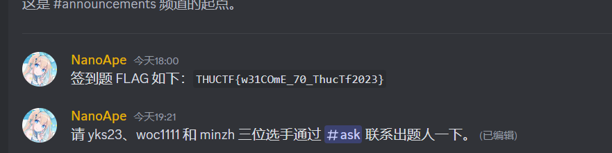

### 呀哈哈

图片隐写题，把所有方法全试一遍就行（？）

最后发现修改长宽后还有内容，拿 tweakpng 改了就行。


### KFC

没有一点地名（看不清），不得已谷歌识图然后就出来了。

截图忘截了，反正是巴黎的一家店。

### 未来磁盘

直接解压！


### Dark(er) Room

翻看源码可以获得地图以及各种事件信息（但其实都是靠试）

然后出来后知道需要 117%的 sanity，于是优化了路线，最后只需要连过 3 次 help 即可，算算概率发现竟然有 1/125，直接写脚本刷。

在地图里可以发现一个 flagroom，尝试获取 flag 可以发现它要我们猜公钥，于是乱输一堆搞崩后发现它在 flag_number 末位为 1 时会更新公钥且更新一次需要花 1s，于是写一个脚本记一下时即可。

两道题都是拿 pwntools 写的。

```python
from pwn import *
import time

io = process("nc chal.thuctf.redbud.info 50825",shell=True)
def lazysend(s):
    io.sendline(s)
    time.sleep(0.05)

def flag1():
    global io
    io = process("nc chal.thuctf.redbud.info 50825",shell=True)
    lazysend("newgame")
    lazysend("123")
    lazysend("y")
    lazysend("n")
    lazysend("n")
    lazysend("e")
    lazysend("pickup key")
    lazysend("w")
    lazysend("s")
    lazysend("s")
    lazysend("e")
    lazysend("e")
    lazysend("e")
    lazysend("pickup trinket")
    lazysend("w")
    lazysend("s")
    lazysend("usewith key door")
    lazysend("s")
    lazysend("s")
    lazysend("n")
    lazysend("w")
    lazysend("w")
    lazysend("w")
    lazysend("n")
    lazysend("pickup key")
    lazysend("s")
    lazysend("e")
    lazysend("e")
    lazysend("e")
    lazysend("n")
    lazysend("n")
    lazysend("w")
    lazysend("use trinket")
    lazysend("w")
    lazysend("n")
    lazysend("n")
    lazysend("w")
    lazysend("w")
    lazysend("usewith key door")
    lazysend("h")
    lazysend("h")
    lazysend("h")
    lazysend("n")
    re = io.recvuntil(b"You have escaped with",timeout=1).decode('utf-8')
    if "THUCTF" in re:
        print(re)
    result = io.recvline().decode('utf-8').strip().replace("% sanity.",'')
    print(int(result))
    if int(result)>=110:
        io.interactive()
    io.close()

for i in range(200):
    flag1()

def flag2():
    lazysend("newgame")
    lazysend("123")
    lazysend("y")
    lazysend("n")
    lazysend("n")
    lazysend("n")
    lazysend("n")
    lazysend("w")
    lazysend("w")
    lazysend("s")
    lazysend("getflag")
    sss=''
    def getbyte():
        count = 0
        global sss
        for i in range(8):
            s=time.time()*1000
            io.sendline("0")
            io.recvuntil(b"Wrong",timeout=5)
            e=time.time()*1000
            if e-s>900:
                count+=2**i
            time.sleep(0.05)
        sss = chr(count)+sss
        print(chr(count),":",count,"   ",sss)

    while True:
        getbyte()
```

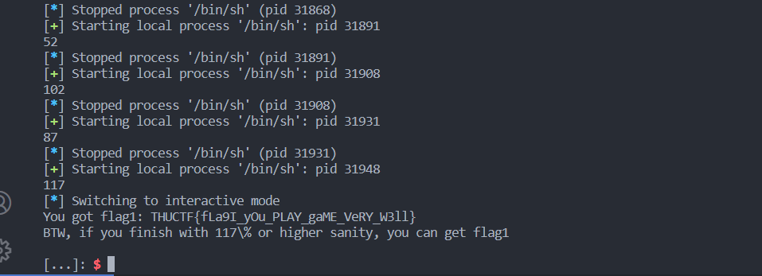

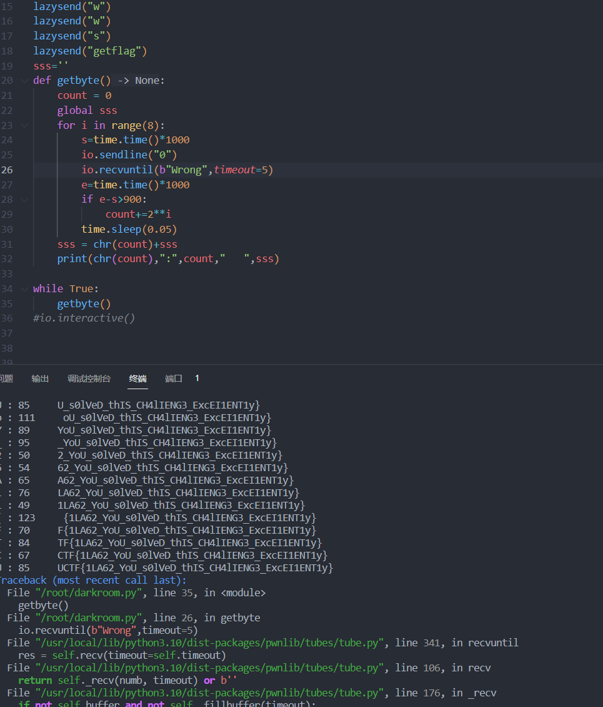

### 基本功

zip 加密且密钥没法爆破，因此只能明文攻击。注意到文件名是一个 zip 爆破软件，所以直接找明文即可。第一题去找 chromedriver，直接搜索文件大小就找得到。第二题是 pcapng 文件，在下面的题里用过，打开看看，再跟网上搜到的文件格式对比一下就可以猜出前 16bytes 的 15 个，然后用-x 爆破即可。解出来后打开文件在最后发现了 flag。


### easycrypto

分析两个给的文件发现一个是字符替换另一是 base64，且使用了同一套字符表，所以放在一起分析。随便在网上找了一个解密器，然后第一题就做出来了。然后去解第二题时发现字符表有很多没用过的字符有错，然后就开始痛苦修 bug。。。反正靠 ascii 的字符编码比较稀疏强行修就行了（）


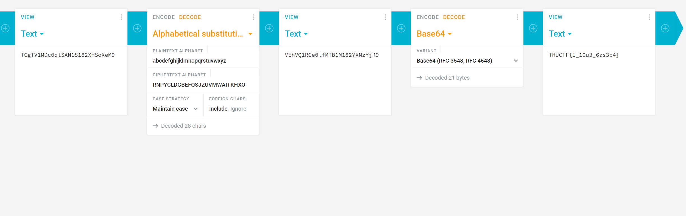

### cookies

在网上搜索后发现 random 库在 624 个 int32 后会可以预测，所以直接从网上找了一个库然后把前 2496 位输进去就解决了第一题。第二题的 entropy 太小了，直接搜索即可。

```python
from random import Random
from randcrack import RandCrack


seed1 = 0x7119E49BD3EC88C863293AB8018E7BDE46242185BBEBE0E1FC5ED8563C605F86
seed2 = 0x0
message = "这里是密文"

message = bytes.fromhex(message)
# print(message)
print(len(message))

def xor_arrays(a, b, *args):
    if args:
        return xor_arrays(a, xor_arrays(b, *args))
    return bytes([x ^ y for x, y in zip(a, b)])

def guess(entropy):
    rc = RandCrack()
    void1 = Random(seed1)
    void2 = Random(seed2)
    void1.randbytes(entropy)
    void2.randbytes(entropy)
    ancient = xor_arrays(
        message, void1.randbytes(len(message)), void2.randbytes(len(message))
    )
    ancient = message
    for i in range(624):
        rc.submit(int.from_bytes(ancient[4 * i : 4 * i + 4], byteorder="little"))

    cwedq = rc.predict_getrandbits(len(message) * 8 - 624 * 32).to_bytes(
        len(message) - 624 * 4, byteorder="little"
    )
    return xor_arrays(ancient[4 * 624 :], cwedq)


# i = 0
# while i < (2 << 22):
#     r = guess(i)
#     if b"THUCTF" in r:
#         print(i)
#         print(r)
print(guess(0))
```


第三题似乎只需要输入相同的 seed 即可通过。然后测试的时候发现少输几个不会报错，结果只输入了一个就过了。。。原来是 zip 只会依据长度小的那个来结束（我不好评价）

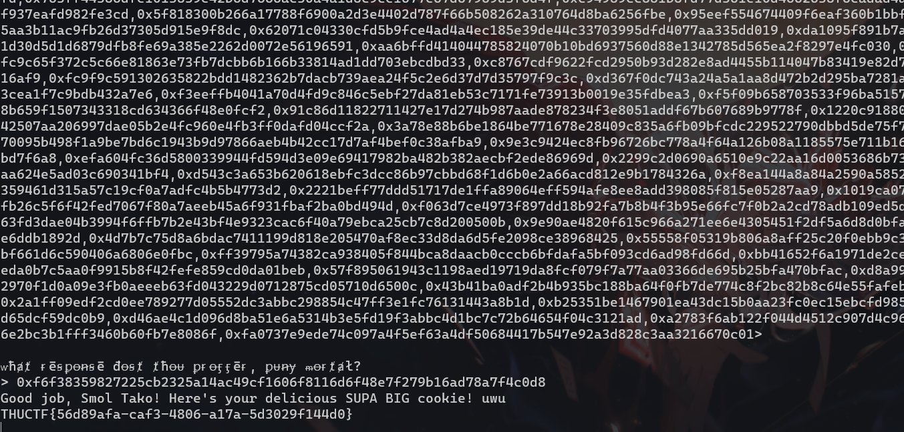

### Another V Me 50

阅读源码可以发现一个账户要有 50 需要重复注册，而 token 只是 sha256 后 14 位，所以可以去撞哈希值。直接拿 python 的 dict 随便写了一个，然后它吃了 16G 内存。。。不过跑出来了就行。。。

```python
from pwn import *
from hashlib import sha256
from os import urandom
import socketserver
import signal
import random
import string

PREFIX = b"CryptoUserInfo"
random.seed(urandom(32))
def lazysend(s):
    io.sendline(s)
    time.sleep(0.05)


def get_token(byte: bytes) -> str:
    return sha256(PREFIX + byte).hexdigest()[-14:]

alphabet = string.ascii_letters + string.digits

def g(l):
    if l == 1:
        for i in alphabet:
            yield i
    else:
        for s in g(l - 1):
            for i in alphabet:
                yield s + i

def force():
    users = {}
    for username in g(10):
        c = get_token(username.encode("utf-8"))
        if c in users:
            return username, users[c]
        else:
            users[c] = username

# a, b = force()
a, b = ("aaaaaaRjiD", "aaaaaam08V")
print(1243234)
print(a)
print(b)

io = remote("chal.thuctf.redbud.info", 50963)
lazysend("1")
lazysend(a)
lazysend(get_token(a.encode("utf-8")))
lazysend("1")
lazysend(b)
lazysend(get_token(b.encode("utf-8")))
lazysend("2")
lazysend(a)
lazysend(get_token(a.encode("utf-8")))
io.interactive()
```

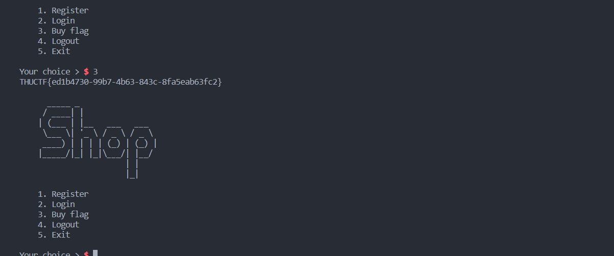

### nc

`nc ip port`


### 禁止执行，启动

观察后发现只有 bin 里的文件可以执行，然后看到了两个不是 busybox 创建的文件，一查发现是 debugger，那随便 debug 一下 busybox 然后在 rip 处写入 shellcode 就行了。主要难点是现学 lldb 的语法~~以及修 bug~~。（以及花了 1 个小时意识到 548 是十进制。。。）


### babystack

IDA 打开后可以发现一个后门函数，然后注意到长度判断是用无符号写的，所以可以输入 0 后栈溢出，依靠提示可以知道要把栈变为 16 的倍数才能调用后门，所以多写一个空的 ret 即可。

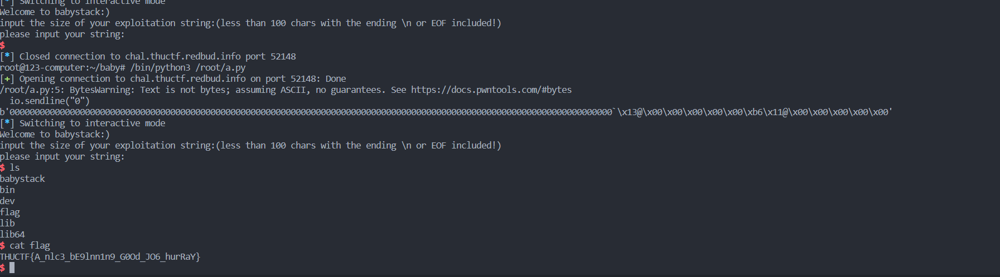

### 初学 C 语言

格式化字符串漏洞，所以只要疯狂%p%x 然后看看里面哪些像 ascii 就行（问就是我也不会）

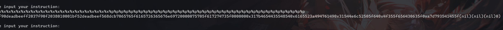

### 简单的打字稿

~~用于推销 typescript 的题。~~

typescript 的类型不会在编译结果中出现，所以只能依靠报错来获取 flag。推荐的方法是用函数传参来做，这样不需要去编一个实例出来。第一题简单传点数字就行。第二题需要将 flag 的值一层层提取出来，所以在网上查到了把 union 变 intersection，获取返回值，获取参数类型的模板，然后一层层套用就行了。但是 intersection 变 union 的模板没找到，好在报错够短能过，就不管了。

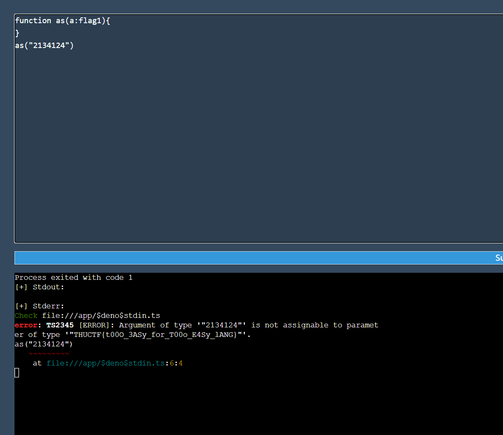


（一些趣事）

本来没打算做第二问，但是在翻选手博客时发现了一篇关于 typescript 类型的文章，于是去做了，虽然这篇文章对最终做出来的答案没啥帮助（）

### Chrone1

本来对问号后面到底怎么写才能改 hostname 没有一点想法，但是提示实在是太强了，直接塞爆然后报错就可以了。


### V ME 50

反复观察 devtools 里面的东西，可以看到一个被注释的权限修改，进去后提交不通过，发现有一个隐藏的 id 栏，修改 value 为 1 后过了。进入管理员发现可以买 kfc 和 flag，然后换了一个账号发现订单没有变，于是只需要开 10 个账号就可以退款买 flag 了。

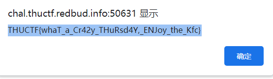

### emodle

做这道题很明显靠 js 是不太够的，所以用了 selenium 来暴力搜索。第二问限制到了 8 次就没法解了，所以尝试去攻击 session，结果 session 是用 base64 编码的，而且答案还在里面，直接抄就行了。（后来才知道这东西叫 JWT）第三问删去了答案，且需要在 1 分钟内做完。但是注意到每次提交 session 都会更新，于是把 session 改回去后发现还可以玩，于是只要 selenium 继续暴力就行了。（selenium 真好用）

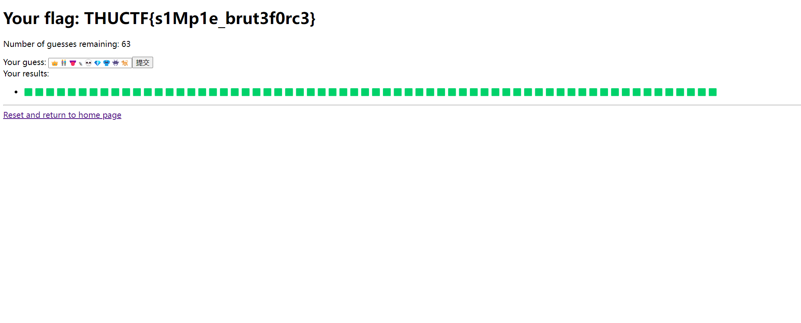

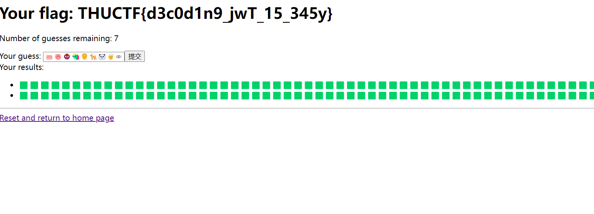

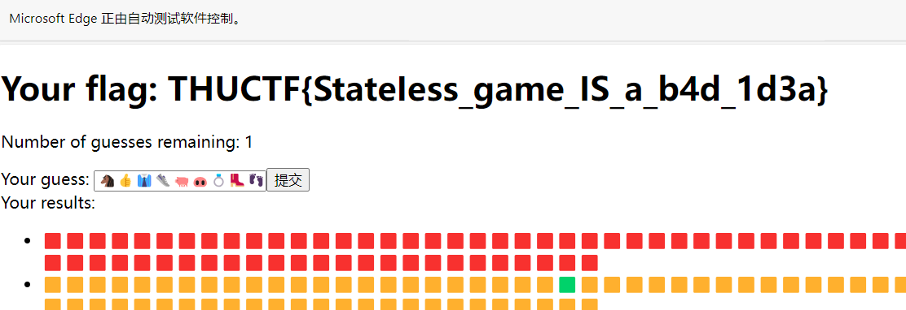

### polynomials

纯逆向题。第一题可以很快发现是一个矩阵在 F_p 下求逆，然后上网抄代码（）。第二题是一堆奇怪玩意看不懂，选择手动写逆运算，然后看着那些常数觉得很怪，结果解出来发现是 NTT。。。第三问吸取了教训，知道是多项式乘法，直接除回去。

```python
import numpy
from sympy import Matrix, mod_inverse
import base64

p = 998244353


def matInvMod(vmnp, mod):
    nr = vmnp.shape[0]
    nc = vmnp.shape[1]
    if nr != nc:
        print("Error: Non square matrix! exiting")
        exit()
    vmsym = Matrix(vmnp)
    vmsymInv = vmsym.inv_mod(mod)
    vmnpInv = numpy.array(vmsymInv)
    k = nr
    vmtest = [[1 for i in range(k)] for j in range(k)]  # just a 2-d list
    vmtestInv = vmsym * vmsymInv
    for i in range(k):
        for j in range(k):
            # print i, j, vmtrx2[i,j] % mod
            vmtest[i][j] = vmtestInv[i, j] % mod
    print("test vmk*vkinv % mod \n:", vmtest)
    return vmnpInv


def reverse1():
    # p = 271
    k = 38
    a = [
        9403659313894707252,
        10993934582569577013,
        7795846728707237000,
        9191877155529135904,
        9908595251531158310,
        8660794244482574322,
        9874644655622856331,
        11162974483227675571,
        8812079262269580364,
        7753715510343656484,
        8903987252496368507,
        7868707299292224701,
        10611895060740010939,
        8123730605949078930,
        9609585807820621655,
        10265959052407839358,
        9267314521215120029,
        8352173460569731505,
        9303887510029974835,
        8883709811136466809,
        7879371872137715806,
        6849904959337600240,
        7512572632694415070,
        9819292060154201339,
        9002269748658262723,
        7492430953564765751,
        10110377915354936043,
        10141655795860606204,
        9164981623634819530,
        8972211292508642404,
        9705815770843805343,
        9917308592076637025,
        9178840956744520441,
        8757239147483357276,
        8363174767189842779,
        6905656485193533262,
        8306059725396726094,
        9827326457780163779,
    ]

    for t in a:
        print(hex(t % p)[2:])

    vvv = numpy.array(
        [
            0x0CB0,
            0x168C83AC,
            0x0D1D79D4,
            0x228A0DD,
            0x0E57451,
            0x25F3BF43,
            0x0F1653F7,
            0x395B969F,
            0x37198928,
            0x1651D179,
            0x20F1DF11,
            0x38F4DC2B,
            0x37CDD474,
            0x2043323C,
            0x0E4CB532,
            0x14FE0ADA,
            0x2DADCE9D,
            0x2C325FFB,
            0x0D9357C,
            0x1C90D4E6,
            0x19A7E972,
            0x24EAABA9,
            0x2C2A70ED,
            0x315995C6,
            0x1E48BE27,
            0x99C05B0,
            0x0EE775B0,
            0x27F52AA6,
            0x136F26DB,
            0x5CE66CF,
            0x37F9958D,
            0x2D634F37,
            0x0F424CE3,
            0x2348C868,
            0x0A16629F,
            0x2ACC2B38,
            0x0F7FEB61,
            0x159215F5,
        ]
    )
    vm = numpy.array([[(j + 1) ** i for i in range(k)] for j in range(k)])
    # vminv = modMatInv(vm, p)
    print(vm.dot(vvv))
    vminv = matInvMod(vm, p)
    print(vminv)
    vmtestnp = vm.dot(vminv) % p  # test mtrx inversion
    print(vmtestnp)
    print((vminv.dot(vvv)) % p)


def reverse2():
    output = "zA8AAAQBAACR20kH6CQ2NCnKEw1xIConw/anNmUeGgw50hofiOzzAYcLCgLRq8M2MZBVBfSzxDRVgXASOMUYDPKa/Cqp7+oRmFmLCI/9wCwkCjcQo9LGCQWL0CmU1/QETk5fLASDAzoeuXEglllEG/U8NzHpbegh+CG/N/s0kS8FBXchrTF6Ape+QxD5v4QMkWgoLk4FqCcS3oY4hzPgIO8k/hv1nIMBEq9iJUSfAAk7Skso7HCqLqS7WQhBzAcV5cI0O/MZWCoioRoqs6HIFefUlCscB2A3r8NjLr0QXjE8UFQLjkD0Bj4NQAkAj7g4AwttMwTMTRbxvdsuNeJTDg=="
    output = base64.b64decode(output)
    vvv = []

    info = [
        0x00000000,
        0x00000001,
        0x00000001,
        0x3656D65B,
        0x00000001,
        0x163456B8,
        0x3656D65B,
        0x1D21561B,
        0x00000001,
        0x375FE6C1,
        0x163456B8,
        0x257C787F,
        0x3656D65B,
        0x16400573,
        0x1D21561B,
        0x2766E2AB,
        0x00000001,
        0x1AFD27AC,
        0x375FE6C1,
        0x27B55371,
        0x163456B8,
        0x0A25E8C8,
        0x257C787F,
        0x337E65BE,
        0x3656D65B,
        0x24C90037,
        0x16400573,
        0x20677ED8,
        0x1D21561B,
        0x267C5B5F,
        0x2766E2AB,
        0x3647FC39,
        0x00000001,
        0x3700CCCC,
        0x1AFD27AC,
        0x00E5B307,
        0x375FE6C1,
        0x131D28F6,
        0x27B55371,
        0x13477C50,
        0x163456B8,
        0x0448FFEC,
        0x0A25E8C8,
        0x16D34EAF,
        0x257C787F,
        0x320E0843,
        0x337E65BE,
        0x1132615E,
        0x3656D65B,
        0x0647D7A5,
        0x24C90037,
        0x0AD6B6CD,
        0x16400573,
        0x2ACA743E,
        0x20677ED8,
        0x0498A9B2,
        0x1D21561B,
        0x1CC06735,
        0x267C5B5F,
        0x17D4C6BF,
        0x2766E2AB,
        0x06B059A5,
        0x3647FC39,
        0x172CA754,
        0x00000001,
        0x2E97FC55,
        0x3700CCCC,
        0x341E50E0,
        0x1AFD27AC,
        0x036D036A,
        0x00E5B307,
        0x126C756C,
        0x375FE6C1,
        0x13F7A236,
        0x131D28F6,
        0x0922FC32,
        0x27B55371,
        0x35669A1A,
        0x13477C50,
        0x32321C0E,
    ]

    for i in range(len(output) // 4):
        vvv.append(int.from_bytes(output[4 * i : 4 * i + 4], byteorder="little"))
    print(vvv)

    v9 = 1
    div2 = mod_inverse(2, p)
    while v9 < 64:
        i = ((63) // (2 * v9)) * 2 * v9
        while i >= 0:
            j = v9 - 1
            while j >= 0:
                v8 = (vvv[i + j + v9] * mod_inverse(info[j + v9], p)) % p
                vc = vvv[i + j]
                vvv[i + j] = ((v8 + vc) * div2) % p
                vvv[i + j + v9] = ((v8 - vc) * div2) % p
                j -= 1
            i -= 2 * v9
        v9 *= 2
    print(vvv)
    for i in vvv:
        if i > 128:
            i = p - i
        print(chr(i), end="")


def reverse3():
    output = "DCcAAJxCAABbZwAAin8AAJulAADNwQAAy/YAAAIOAQCILwEAi0wBACVVAQAkiQEAmKMBAEW1AQCvwgEAjAECANT9AQAzMwIAaGACAFeVAgDvigIAcqgCAOTmAgBe7gIAnQoDAO4MAwDAPgMAmmIDAId0AwBOnQMA9+IDAM/sAwBLMAQAZF0EAF5xBAB0xAQAXuoEAIHwBAAp/gQAViYFAME9BQBaNQUAtUsFAAxWBQBsKQUAPlIFALpMBQAwOQUAXyYFAPJSBQBqMQUAlT4FACNYBQC3ZAUA3CwFACgSBQAoXwUAWE0FAEtFBQBXLwUAb00FABE+BQCRXwUAUFoFAA=="
    output = base64.b64decode(output)
    input = "welcome to the world of polynomial"
    ptr = [0] * 64
    for i in range(64):
        ptr[i] = ord(input[i % 34])
    vvv = [0] * 128
    divin = mod_inverse(990445569, p)

    for i in range(len(output) // 4):
        vvv[i] = int.from_bytes(output[4 * i : 4 * i + 4], byteorder="little")

    print(vvv)
    print(ptr)
    sss = []
    divp = mod_inverse(ptr[0], p)
    for i in range(64):
        c = (vvv[i] * divp) % p
        for j in range(64):
            vvv[i + j] = (vvv[i + j] - c * ptr[j]) % p
        print(c)
        print(vvv)
        sss.append(chr(c))
    print("".join(sss))
```

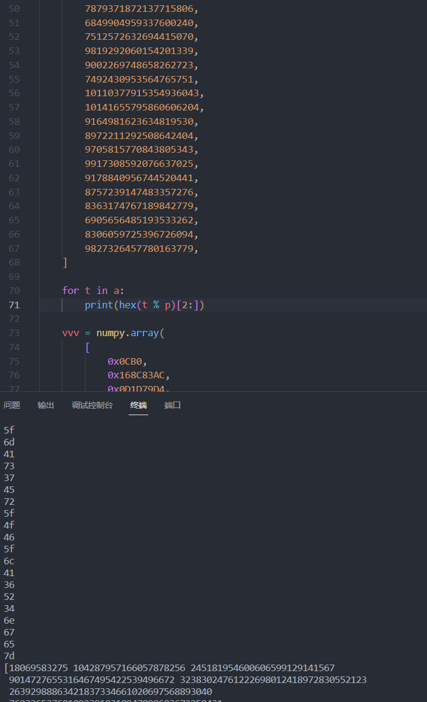


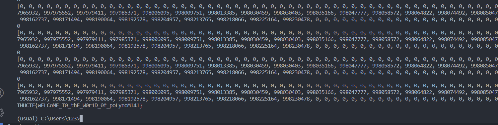

### 扫雷

重量级题目。

简单玩玩就可以发现它有一个几乎固定的边框，而且里面的大块十分的方正，除了少数同一种特殊玩意。然后写脚本把所有大块都先点了。然后发现解不动了，于是去看右边的 3 个一组的玩意，折磨了好久，最后解出来是一个 3-SAT。。。知道了就好办了，直接枚举就可以确定唯一解，然后让脚本把关键块点出来后疯狂右键就行了。

脚本采用了注入了 render 的方法来进行回调，然后就可以写了，甚至没有 js 压缩（）

```javascript
async function sleep(t) {
  return new Promise((resolve) => {
    setTimeout(resolve, t);
  });
}

function renderboard() {
  if (!checkready()) {
    setTimeout(renderboard, 100);
    return;
  }
  console.log("rendering");
  let boardx = boardobj.sizex;
  let boardy = boardobj.sizey;

  if (boardobj.type == 0) {
    board = [];
    for (let i = 0; i < boardx; i++) {
      board[i] = boardobj.board[i].split("");
    }
  } else {
    for (let i = 0; i < boardobj.board.length; i++) {
      let x = boardobj.board[i][0];
      let y = boardobj.board[i][1];
      let st = boardobj.board[i][2];
      board[x][y] = st;
    }
  }

  if (draw) {
    for (let i = 0; i < boardx; i++) {
      for (let j = 0; j < boardy; j++) {
        let st = board[i][j];
        if (lboard != undefined && lboard[i][j] == st) {
          continue;
        }
        let id = 0;
        if (st == "F") id = 10;
        else if (st == "*") id = 11;
        else if (st == ".") id = 9;
        else id = parseInt(st);
        ctx.drawImage(
          images[id],
          j * TILE_SIZE,
          i * TILE_SIZE,
          TILE_SIZE,
          TILE_SIZE
        );
      }
    }
    lboard = JSON.parse(JSON.stringify(board));
  }
  find();
}

function find() {
  if (first) {
    first = false;
    callback();
  }
}

async function detect_times(t) {
  for (var i = 0; i < t; i++) {
    await run(0, 0, "detect");
    console.log(i + 1);
  }
}

var callback = () => {};
var first = true;
var draw = 1;

async function run(x, y, type = "open") {
  if (x >= boardobj.sizex || y >= boardobj.sizey) {
    return new Promise((resolve) => {
      resolve();
    });
  }
  if (type == "open" && board[x][y] != ".") {
    return new Promise((resolve) => {
      resolve();
    });
  }
  first = true;
  var c = new Promise((resolve) => {
    callback = resolve;
  });
  if (type == "open") {
    doopen(x, y);
    console.log("run doopen(" + x + ", " + y + ")");
  }
  if (type == "detect") {
    dodetect();
    console.log("run dodetect()");
  }
  return c;
}

async function main() {
  await run(0, 0);
  let boardx = boardobj.sizex;
  let boardy = boardobj.sizey;
  locationy = new Array();
  for (let i = 1; i < boardy; i++) {
    if (board[1][i] == "3") {
      locationy.push(i);
    }
  }
  console.log(locationy);
  draw = 0;
  bin = [];
  for (let i = 0; i < locationy.length; i++) {
    column = locationy[i] + 2;
    for (var j = 4; j < boardx; j++) {
      var c = board[j][column];
      if (c == "0") continue;
      if (c == ".") continue;
      if (j + 1 < boardx && board[j + 1][column] == ".") {
        if (c == "1") {
          await run(j + 3, column);
        }
        if (c == "2") {
          await run(j + 1, column - 1);
          await run(j + 1, column);
          await run(j + 2, column);
          await run(j + 3, column);
          await run(j + 3, column + 2);
          await run(j + 4, column);
          await run(Math.floor(j / 3) * 3 - 1, column - 2);
          bin[j + 2] = column;
          await run(j + 6, column);
        }
      }
    }
  }
  draw = 1;
  console.log(bin);
  await run(0, 0, "detect");
  await update();
}

async function update() {
  await run(0, 0);
  let boardx = boardobj.sizex;
  let boardy = boardobj.sizey;
  locationy = new Array();
  for (let i = 1; i < boardy; i++) {
    if (board[1][i] == "3") {
      locationy.push(i);
    }
  }
  locationx = new Array();
  for (let j = 1; j < boardx - 1; j++) {
    if (board[j + 1][113] == "1" && board[j - 1][113] == "1") {
      locationx.push(j);
    }
  }
  // console.log(locationx)
  // console.log(locationy)
  mark = new Array();
  for (var i = 0; i < locationx.length; i++) {
    for (var j = 0; j < locationy.length; j++) {
      if (board[locationx[i] + 1][locationy[j] - 3] == "3") {
        if (
          board[locationx[i] + 2][locationy[j] - 3] == "2" &&
          board[locationx[i]][locationy[j] - 3] == "2"
        ) {
          //console.log(i, j)
          mark[i] = j;
        }
      }
    }
  }
  neg = new Array();
  for (var i = 0; i < locationx.length; i++) {
    neg[i] = board[locationx[i] + 1][117] == "3";
  }
  console.log(mark);
  console.log(neg);
  var result = new Array();
  for (i = 0; i < 2 << locationy.length; i += 2) {
    var b = new Array();
    for (var j = 0; j < locationy.length; j++) {
      b[j] = Boolean(i & (2 << j));
    }
    var flag = 1;
    for (j = 0; j < locationx.length; j += 3) {
      c = neg[j] ^ b[mark[j]];
      c = c || neg[j + 1] ^ b[mark[j + 1]];
      c = c || neg[j + 2] ^ b[mark[j + 2]];
      if (!c) {
        flag = 0;
        break;
      }
    }
    if (flag) {
      result.push(b);
      console.log(i);
      // console.log(b)
    }
  }
  console.log(result);
  async function apply(r) {
    for (var i = 0; i < locationy.length; i++) {
      if (r[i]) {
        await run(4, locationy[i]);
      } else {
        await run(3, locationy[i]);
      }
    }
    for (var i = 0; i < locationx.length; i++) {
      await run(locationx[i], 112);
      if (r[mark[i]]) {
        await run(locationx[i], 113);
      } else {
        await run(locationx[i], 111);
      }
      if (i % 3 == 0) {
        await run(locationx[i], 138);
        await run(locationx[i], 126);
      }
    }
  }
  apply(result[0]);
}

main();
```


### 汉化！

~~还好我之前拆过~~。去网上找 kirikiri2 的解包软件即可。打开在最后一个场景就可以发现 flag（我被骗了）第二问需要研究它是怎么判断相等的，发现是一个哈希，但爆破这个哈希会有很多解，于是继续去拆存档，注意到除了 data0 以外的另外两个文件也是可以拆的，然后就发现了游戏所有选项的选择次数，于是就加上限制条件继续枚举就解出来了。

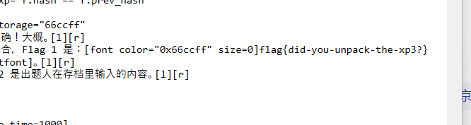


### 流量包

打开第二题的流量包，发现很多的 ascii 字符，于是去搜索了一下发现是一个古老的协议。用 lrzsz 链接即可。第二题需要去翻协议细节，然后在知乎上找到了一个实现的源码，然后用 python 抄一份就行（问就是不会写 cmake）但是需要注意把源码的 crc16 换成 crc32，不然就得自己在本地抓包修 bug 了。

```python
import os

raw = b""
# with open("flag2.jpg", "rb") as fp:
#     tran = fp.read()
with open("flag.jpg") as fp:
    tran = fp.read().replace("\n", "").replace(" ", "")
    tran = bytes.fromhex(tran)

eat_crc = 0
print(len(tran))
count = 0
for i in tran:
    if i == 24:
        count += 1
print(count)
traned = 0
tr = 0

for i in range(len(tran)):
    u = tran[i].to_bytes()
    if not traned:
        if eat_crc:
            eat_crc -= 1
            if tr:
                tr = 0
                continue
            if u == b"\x18":
                eat_crc += 1
                tr = 1
            continue
        if u != b"\x18":
            raw += u
            continue
        else:
            traned = 1
            continue
    traned = 0
    if u == b"\x69":
        eat_crc = 4
        continue
    if u == b"\x68":
        eat_crc = 2
        continue
    if u == b"\x6c":
        raw += b"\x7f"
        continue
    if u == b"\x6d":
        raw += b"\xff"
        continue
    if tran[i] & 0x60 == 0x40:
        raw += (tran[i] ^ 0x40).to_bytes()
    else:
        print(i)

# print(raw)
with open("flag3.jpg", "wb") as fp:
    fp.write(raw)
```


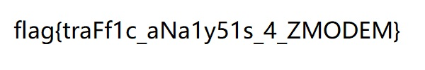

### 喵

做这道题需要写一个简易编译器喵。

可以修改一下 filtered 实现 debug 喵。

第一题重复把字符换成 emoji 谢谢喵。

重复把 10 个 emoji 换成另一个 emoji 谢谢喵。

剩下的 emoji 就是个位数喵。

重复这件事喵。

第二题在每行后面加上长度喵。

对长度第一位做冒泡排序喵。

写一个简易栈来对第二位继续排序喵。

对需要排的和已经排好的位都标记一下喵。

然后就排好了喵

谢谢喵

```python
import re
from re import Pattern
from dataclasses import dataclass
from typing import TextIO
import os

inst = []

os.chdir(os.path.dirname(__file__))
print(os.getcwd())


class Inst:
    pass


@dataclass(frozen=True)
class Replace(Inst):
    repeat: bool
    regex: str
    to: str


@dataclass(frozen=True)
class Branch(Inst):
    neg: bool
    regex: str
    label: str


@dataclass(frozen=True)
class Label(Inst):
    value: str


def replace(reg, to, repeat=True):
    inst.append(Replace(bool(repeat), reg, to))


def branch(neg, reg, label):
    if reg == "":
        reg = "^"
    inst.append(Branch(bool(neg), reg, label))


def label(name):
    inst.append(Label(name))


def compile():
    output = []
    for i in inst:
        s = ""
        if isinstance(i, Replace):
            if i.repeat:
                s = "重复"
            s += f"把【{i.regex}】替换成【{i.to}】喵"
        if isinstance(i, Branch):
            s = "如果"
            if i.neg:
                s += "没"
            s += f"看到【{i.regex}】就跳转到【{i.label}】喵"
        if isinstance(i, Label):
            s = i.value + "："
        output.append(s)
        # print(s)
    output.append("谢谢喵")
    # print("谢谢喵")
    return output


def moew1():
    replace("[^👆]", "👆")
    replace("$", "👀", False)
    label("load")
    replace("👆" * 10, "👌")
    replace("👀", "👆👀", False)
    for i in range(10):
        replace("👆" * (10 - i) + "👀", "👀" + str(9 - i), False)
    replace("👌", "👆")
    branch(False, "👆", "load")
    replace("👀", "", False)


def moew2():
    replace("^", "👂", False)
    replace("$", "👂", False)
    replace("\\n", "👂")
    replace("👂👂", "👂")
    replace("👂([^👂💊]+)👂", "👂\\1💊\\1👂")
    replace("💊[^💊👆👂]([^👂💊]*)👂", "💊\\1👆👂")
    replace("💊(👆*)👂", "💊\\1👀👂")
    for i in range(4):
        replace("👆" * 10, "👌")
        replace("👀", "👆👀", False)
        for i in range(10):
            replace("👆" * (10 - i) + "👀", "👀" + str(9 - i), False)
        replace("👌", "👆")
    replace("👀", "", False)

    def sorti(t, recv, send, tmp):
        label(f"sort{t}")
        replace(recv + send, recv + tmp)
        branch(False, tmp * 12, f"sort{t}_end")
        for i in range(10):
            branch(False, tmp * (11 - i), f"sort{t}_case{9-i}")
        label(f"sort{t}_default")
        for i in range(10):
            replace(f"👂([^👀{tmp}]*)👂([^👂👀{recv}{tmp}]*{recv}{i}[^👀👂{recv}]*)👂", "👂\\2👀👂\\1👂")
            replace(f"👂([^👂👀{recv}]*{recv}{i}[^👀👂{recv}]*)👂", "👂\\1👀👂", False)
        replace("👀", "", False)
        replace("$", tmp * 2, False)
        branch(False, "", f"sort{t}")
        for i in range(10):
            label(f"sort{t}_case{i}")
            replace(f"👂([^👂{recv}]*){recv}{i}([^👂{recv}]*)👂", f"👂\\1{recv}{send}\\2👂")
            replace(tmp * (i + 2), tmp * (i + 3), False)
            if t > 1:
                branch(False, "", f"sort{t-1}")
            else:
                branch(False, "", f"sort{t}")
        label(f"sort{t}_end")
        replace(tmp*12,"",False)
        branch(False, "", f"sort{t+1}")

    global s
    global v
    s = "💊"
    v = s
    def sortii(t,a,b):
        global s
        global v
        v+=b
        sorti(t,s,a,b)
        s+=a
    # sortii(5,"👸","🐳",)
    sortii(4,"🐾","🐨")
    sortii(3,"👢","🐘")
    sortii(2, "👭","🐲" )
    sortii(1, "🐻", "🐸")

    label("sort5")
    print(v)
    replace(v,"")
    replace("^👂","",False)
    replace("👂$","",False)
    replace("👂","\\n")

    # for i in range(10):
    #     replace(f"👂([^👂👀💊]+)💊{i}([^👀 💊 ) 👂", "👂\\1👆💊\\2👀👂", False)
    #     Branch(False, "", "sort4")
    # label("sort4")
    # for i in range(10):
    #     replace(f"👂([^👀]*)👂([^👂👀💊]+👆💊{[}^ 👂   💊] + )👂", "👂\\2👀👂\\1👂")
    #     replace(f"👂([^👂👀💊]+👆💊{i}[^👀👂💊] +) 👂", "👂\\1👀👂", False)
    # replace("👀", "", False)


moew2()

s=""
v=""
out = compile()
with open("input.txt", "w", encoding="utf-8") as fp:
    for s in out:
        fp.write(s)
        fp.write("\n")
```

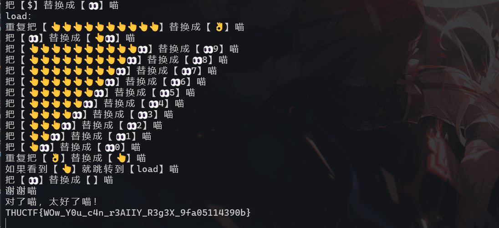

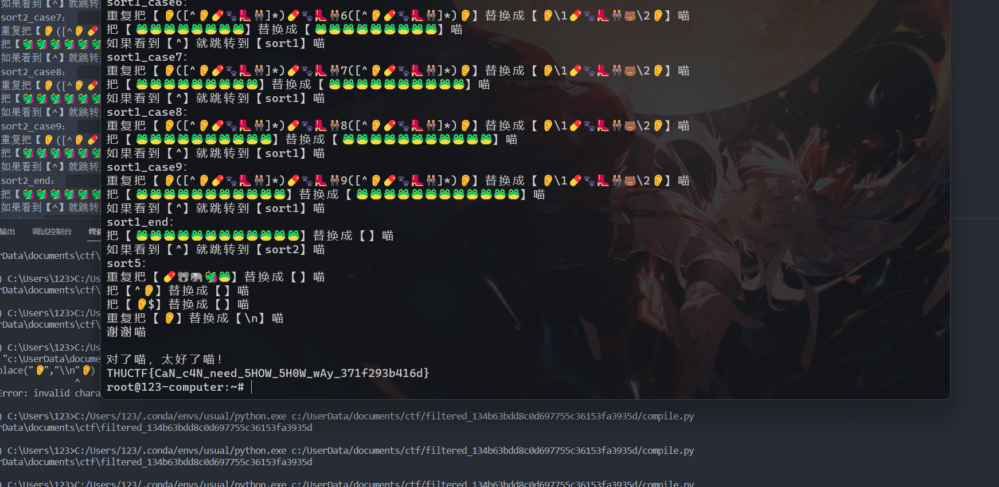
