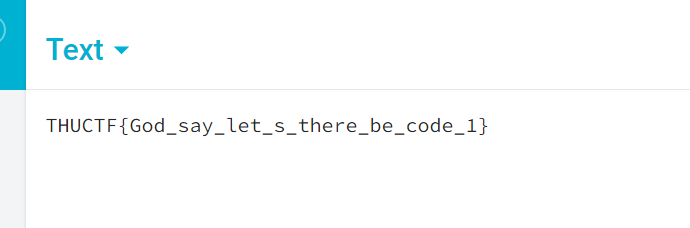
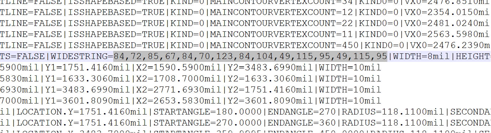
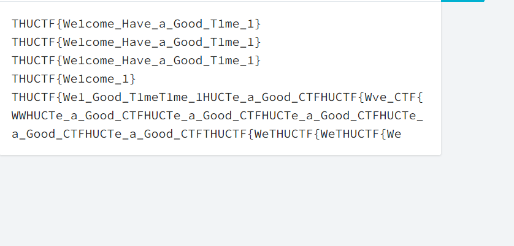
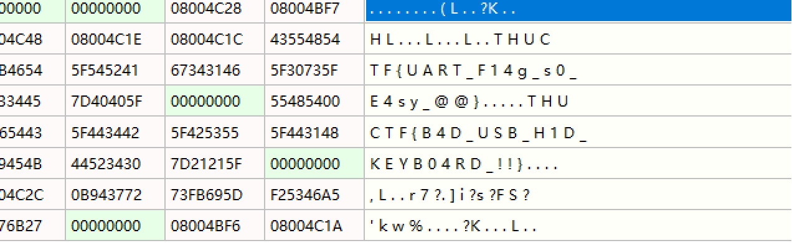
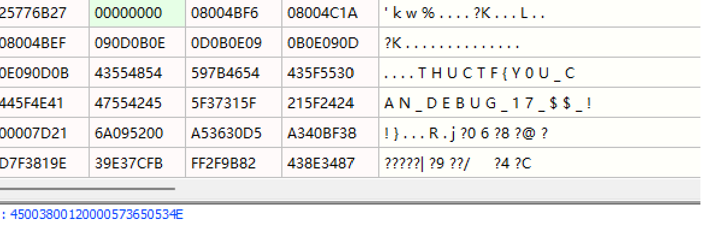
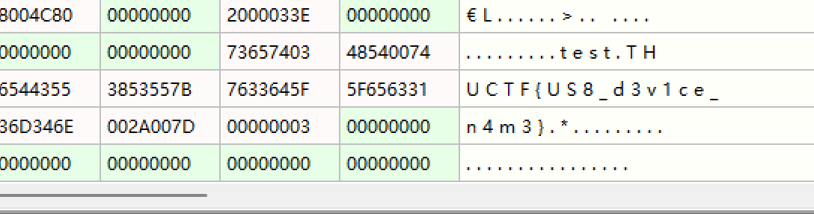
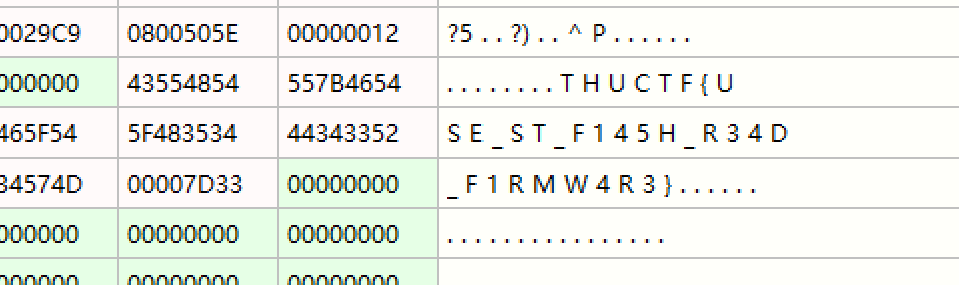

# THUCTF2023-IoT

### Barcode

7 位 1 个字符，直接手抄了。


### 这是你的电路板吗？这就不是！

打开 pcb 文件，可以看见上面印着`Not_Mori's}`。
但是找了半天也没找到前一半，然后突然意识到这个字符串不是画上去的而是一个字符串，所以直接 txt 打开源文件去翻。


### Harmony - Turn up the light!

阅读题。

### Secret

一下载 Windows Defender 直接拦截了，所以到 wsl 里面用 curl 下载。
一打开发现是一个套了很多层的 b64decode，直接把每层的 eval 换成 echo 手动解码。
最后得到了一个字符串，每两个数列为一组。经过研究，发现这一组里面相除是一个整数，所以把这些整数变成 ascii 就是 flag 了。

```python
k = "......"
u = k.split("\n")
c = []
for t in u:
    i = t.strip()
    if i != "":
        c.append(i)
print(len(c))
import json, math

for i in range(len(c)):
    c[i] = json.loads(c[i].replace("'", '"'))
for i in range(44):
    u1 = c[2 * i]
    u2 = c[2 * i + 1]
    print(float(u2[0]) / float(u1[0]))
    print(hex(math.floor(float(u2[0]) / float(u1[0]) + 0.5))[2:])
```

### Hello Harmony

把文件里面所有 ascii 字符弄出来然后看看那个像就行。


### STM32

只要把线接对就没有难度了。沉迷接线忘记截图了，就直接把读内存里的 flag 吧。




